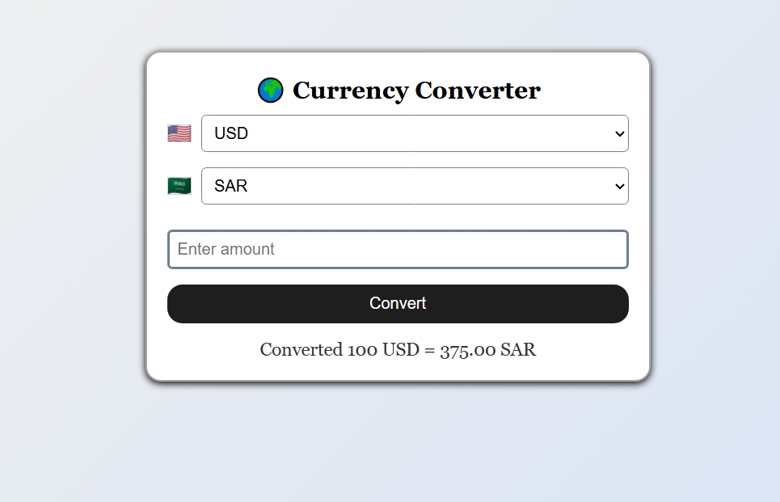

💱 Currency Converter App
This is a simple web-based currency converter that allows users to convert from one currency to another using real-time exchange rates fetched from an API. The app supports multiple currencies and displays country flags for easy recognition.

🚀 Features
Convert between different currencies (USD, EUR, SAR, etc.)

Fetches live exchange rates via ExchangeRate API

Easy-to-use interface with country flags

Responsive design

Styled with CSS and interactive with JavaScript

🛠️ Tech Stack
HTML

CSS

JavaScript (ES6+)

ExchangeRate API

📸 Preview

📂 Setup
Clone the repository:

git clone https://github.com/yourusername/currency-converter.git
Open index.html in your browser.

No additional dependencies are required.

📬 Feedback
Pull requests are welcome! For feedback or suggestions, feel free to contact me.